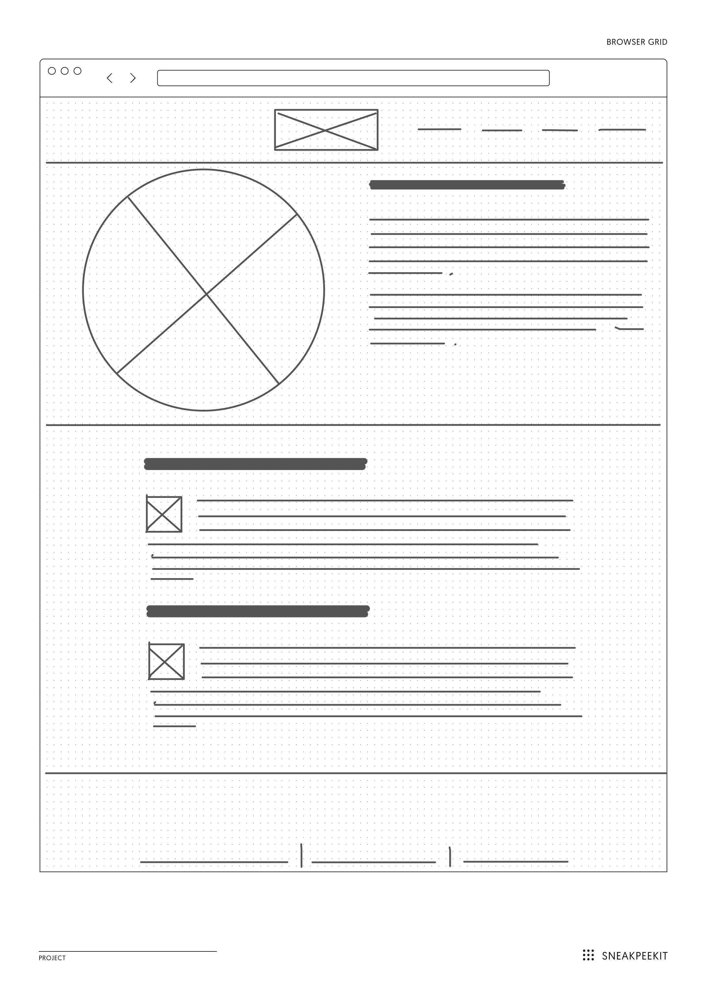

# Practicing HTML & CSS

**Goal**: Practice your HTML and CSS skills by recreating the image at the bottom of this page as a basic, yet semantic, website. Feel free to also include additional elements for practice and apply a simple color scheme. After you read James' *Web Typography* chapter for next Tuesday, apply a typography scheme for the text.

**Due**: Tuesday, 04/23/19 @ 2:00pm.

Follow the usual procedure:

1. Fork to your profile
2. Clone your forked version to your computer
3. Create your own folder within this root folder, as follows:
  1. Create a new folder with the name: <code>lastname-css</code>, where "lastname" is your last name. **NOTE** the example folder with my name: <code>lindgren-css</code>.
  2. Inside your specific folder,
    1. Create an index.html file.
    2. Create an <code>assets</code> folder.
    3. Inside <code>assets</code>, create a <code>css</code> folder.
    4. Inside <code>css</code>, create a <code>style.css</code> file.
4. Once you create this basic structure, then attempt to create a semantic version of the image above. **DO NOT** use Atom's page rendering feature. Instead, practice designing this site with the browser's inspection tool. See the placholder options in the references section.
5. Once you've completed your practice site, follow the procedure: push the changes to your forked code reop, then create a pull request to the org.

## Resources

- Placeholders: <a href="https://placeholder.com/" target="_blank">Images</a> &amp; <a href="https://placeholder.com/text/lorem-ipsum/" target="_blank">Standard Lorem Ipsum</a> and <a href="https://hipsum.co/" target="_blank">Hipster Ispum</a>
- Mozilla Developer Network: <a href="https://developer.mozilla.org/en-US/docs/Web/HTML" target="_blank">HTML</a>, <a href="https://developer.mozilla.org/en-US/docs/Web/CSS" target="_blank">CSS</a>

